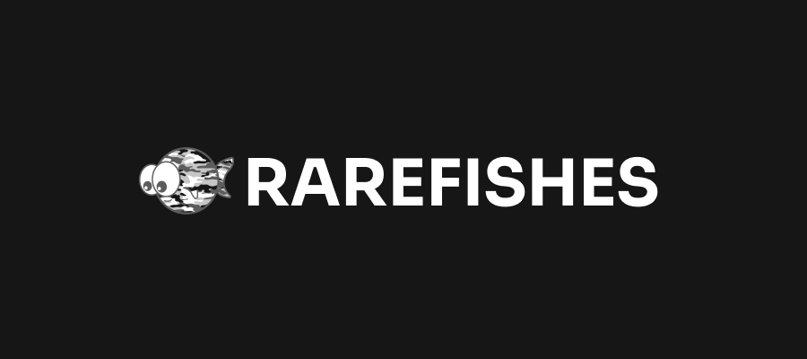

[<p align="center"></p>](https://www.rarefishes.site)

[](https://github.com/rarefishes/rarefishes-website/actions/workflows/app-workflow.yaml)

The RAREFISHES official website

## About ❓

RAREFISHES is a NFT collection created on 2021 by three young relatives fellas, with it's first drop on 28/01/2022.

## Techs 💻

- [`ReactJS`](https://pt-br.reactjs.org)
- [`Typescript`](https://www.typescriptlang.org)
- [`styled-components`](https://styled-components.com/)

## Build Tool :hammer:

- [`Snowpack`](https://www.snowpack.dev/)

## Testing ✔️

- [`Jest`](https://jestjs.io)
- [`ts-jest`](https://kulshekhar.github.io/ts-jest/)
- [`cypress`](https://www.cypress.io/)

## Installing 🚧

Clone this repo:

```

  git clone https://github.com/rarefishes/rarefishes-website.git

```

```

  cd rarefishes-website

```

## Running 🏃

Development mode:

```

  yarn dev

```

Production mode:

```

  yarn build

```

```

  yarn start

```

## Testing 🏃

Running the tests:

```

  yarn test

```

Running cypress for end2end tests:

```

  yarn test:cypress

```

## Development :gear:

Install husky for git hooks:

```

  npx husky install

```

Start coding...

```

  yarn dev

```

## Issues

Found any bug? Feel free to report it [here](https://github.com/RareFishes/rarefishes-website/issues).
